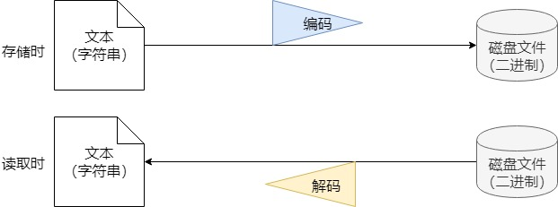

# 简述

现代计算机存储和处理的信息以二值信号表示。

为什么是二进制？
答：

1. > 信息 = 位 + 上下文

所有信息（文本、图像、数字等等）都可以通过二进制位+某种上下文（即某种解释，或者说对应关系）来表示。实际上，用任何进制加一种映射关系都可以表示所有信息。

2. 当构造存储和处理信息的机器时，二进制的值工作得更好。二进制能够**很容易地被表示、存储和传输**。例如，可以表示为穿孔卡片上有洞或无洞、导线上的高电压或低电压，或者顺时针或逆时针的磁场。对二值信号进行存储和执行计算的电子电脑非常简单可靠，制造商能够在一个单独的硅片上集成数百万甚至数十亿个这样的电路。

总结：**有能力+最简单可靠**

本章重点介绍数字的各种二进制表示方法。

# 2.1 信息存储

大多数计算机使用8位的块，或者**字节（byte）**，作为最小的可寻址的存储器单位，而不是在存储器中访问单独的位。机器级程序将存储器视为一个非常大的字节数组，称为**虚拟存储器**。存储器的每个字节都由一个唯一的数字来标识，称为它的**地址**，所有可能地址集合称为**虚拟地址空间**。顾名思义，这个虚拟地址空间只是一个展现给机器级程序的概念性映像。实际的实现（见第9章）是将随机访问存储器（RAM）、磁盘存储器、特殊硬件和操作系统软件结合起来，为程序提供一个看上去统一的字节数组。

编译器和运行时系统将存储空间划分为更可管理的单元，以存放不同的**程序对象**，即**程序数据、指令和控制信息**。每个程序对象可以简单地视为一个字节快，那么程序本身就是一个字节序列。

### 2.1.1 十六进制表示法

| 进制     | 一个字节可表示的数值范围 |
| -------- | ------------------------ |
| 二进制   | 00000000 ~ 11111111      |
| 十进制   | 0 ~ 255                  |
| 十六进制 | 00 ~ FF                  |

| 0    | 1    | 2    | 3    | 4    | 5    | 6    | 7    | 8    | 9    | 10   | 11   | 12   | 13   | 14   | 15   |
| ---- | ---- | ---- | ---- | ---- | ---- | ---- | ---- | ---- | ---- | ---- | ---- | ---- | ---- | ---- | ---- |
| 0000 | 0001 | 0010 | 0011 | 0100 | 0101 | 0110 | 0111 | 1000 | 1001 | 1010 | 1011 | 1100 | 1101 | 1110 | 1111 |
| 0    | 1    | 2    | 3    | 4    | 5    | 6    | 7    | 8    | 9    | A    | B    | C    | D    | E    | F    |

十六进制用于常用于表示位模式。因为相较于2二进制更简短，且很容易和二进制相互转化。

### 2.1.2 字

每台计算机都有一个**字长（word size）**，指明整数和指针数据的标称大小。因为虚拟地址是以这样的一个字来编码的，所以字长决定的最重要的系统参数就是虚拟地址空间的最大尺寸。换言之，对于一个字长为w位的机器而言，虚拟地址的范围为0~2^w-1，即程序最多访问2^w个字节。

32位计算机的最大虚拟地址空间为 2^32 byte = 2^22 KB = 2^12 MB = 4 GB
64位计算机的最大虚拟地址空间为 2^64 byte = 2^34 GB = 2^24 TB = 2^14 PB

### 2.1.3 数据大小

| C 声明        | 32位机器上字节数 | 64位机器上字节数 |
| ------------- | ---------------- | ---------------- |
| char          | 1                | 1                |
| short int     | 2                | 2                |
| int           | 4                | 4                |
| long int      | **4**            | **8**            |
| long long int | 8                | 8                |
| char *        | **4**            | **8**            |
| float         | 4                | 4                |
| double        | 8                | 8                |

需要注意，long int和指针类型，在32位机器和64位机器上大小不一样。当编写可移植程序时，需小心数据大小不一致带来的问题。比如，试图用int类型的变量来存储一个指针，在32位机器上可以工作，在64位机器上会溢出。

### 2.1.4 寻址和字节顺序

对于需要多个字节来存储的程序对象，我们必须建立两个规则：
1. 如何定义这个对象的地址？
2. 在存储器中如何排列这些字节？

1. 如何定义这个对象的地址？
在几乎所有的机器上，**多字节对象都被存储为连续的字节序列，对象的地址为所使用字节中最小的地址**。

> 假设一个类型为int的变量x的地址为0x100，也就是说，地址表达式&x的值为0x100，那么x的4个字节将被存储在存储器的0x100,0x101,0x102,0x103位置上。

2. 在存储器中如何排列这些字节？
排列程序对象的字节有两种方式：
* 小端法：最低有效字节在前面。从最低有效字节到最高有效字节排列。
* 大端法：最高有效字节在前面。从最高校友字节到最低有效字节排列。

假设有一个变量x类型为int，位于地址0x100处，它的十六进制值为0x01234567，则其排列为：
| -      | 0x100 | 0x101 | 0x102 | 0x103 |
| ------ | ----- | ----- | ----- | ----- |
| 小端法 | 67    | 45    | 23    | 01    |
| 大端法 | 01    | 23    | 45    | 67    |

从技术角度将，大端法和小端法没有本质差别，现代处理器都支持“双端法”，即可以自行配置成大端法还是小端法。对于大多数程序员来说，字节顺序是不可见的，不用关心。
但是，有些情况下字节顺序会成为问题：
1. 不同表示法的机器之间通过网络传送二进制数据时。
2. 当程序员阅读表示整数数据的二进制数据时。
3. 当编写规避正常的类型系统的程序时。

### 2.1.5 表示字符串

C语言中字符串被编码为一个以null（其值为0）字符结尾的字符数组。每个字符都由某个标准编码来表示，最常见的是ASCII字符码。

文本文件和二进制文件的区别？

个人理解：其实不存在“文本文件”和“二进制文件”的区别。存储在硬盘上的文件，都是二进制形式，所以都是二进制文件。具体怎么产生“文本文件”这种说法的呢？主要是在处理文本（也就是字符串）的时候，字符本身和二进制数据之间存在一个映射关系。因此，在存储文本数据时，需要通过某种编码转化为二进制数据，然后保存到磁盘上。而在读取时，需要指定编码，转换为对应的文本，才能正常读取。即：

也就是说，读取存储着让人看的文本内容的文件时，需要指定正确编码，才能正常读取。这种文件被人们称为“文本文件”。

而其他存储不是让人看的数据，比如程序数据、指令等，会直接以二进制形式存储和读取，中间不存在编码解码过程，这种文件被人们称为“二进制文件”。但其实如何将读取到的二进制数据转化为可使用的程序对象，本身这也是一个“解码”过程。只不过这个过程是程序自定义的。而文本文件的编码通常是有标准规范的。

再扩展一下，HTTP协议是一个“文本传输协议”，即其传输的是文本的二进制编码。当我们需要跨进程传递程序数据时，比如对象，使用HTTP协议性能不高。因为需要先将对象转化为文本形式，然后编码，再传输。接收端先解码为文本格式，然后再“解码”为对象。为了提高性能，很多“二进制传输协议”诞生。它们直接传递程序对象的二进制编码，减少了转化过程。

书上说“文本数据比二进制数据具有更强的平台独立性（没有大小端问题）”，这种说法应该是不准确的。只有当使用的编码格式让一个字符只需要一个字节表示时，比如ascii，才能规避大小端的问题。如果使用unicode编码，每个字符需要两个字节表示，那么依然会存在大小端问题。

### 2.1.6 表示代码

从机器的角度来看，**程序仅仅是字节序列**。
文本形式的代码经过编译后生成机器代码。不同类型的机器使用不同且不兼容的指令和编码方式。即使机器相同，但操作系统不同，也会有不同的编码规则。因此二进制代码是不兼容的。

### 2.1.7 布尔代数简介

* 逻辑与：`&`。两者都为真。
* 逻辑或：`||`。两者至少有一个为真。
* 逻辑异或：`^`。两者有一个为真但不都为真。即两者不相同。a^a=0。a^0=a。a^1=~a。相当于不带进位的二进制加法。
* 逻辑非：`~`。取反。

**位向量**：有固定长度w、由0和1组成的串。位向量的运算可以定义成参数的每个对应元素之间的运算。
位向量可用于表示有限集合。长度为w的位向量可表示w个元素，位0代表有，位1代表没有。如位向量[01101001]表示集合{0,3,5,6}。使用这种编码集合的方法，布尔运算|和&分别对应于集合的并和交，而~对应于集合的补。

### 2.1.8 C语言中的位级运算

### 2.1.9 C语言中的逻辑运算

### 2.1.10 C语言中的移位运算

`x<<k`：x向左移动k位，丢弃最高的k位。
`x>>k`：
* 逻辑右移：在左端补k个0.
* 算术右移：在左端补k个最高有效位。对有符号整数运算非常有用。

C语言标准没有明确定义应该使用哪种类型的右移。但几乎所有编译器都对有符号数据使用算术右移。

## 2.2 整数表示

### 2.2.1 整型数据类型

### 2.2.2 无符号数的编码

用于表示无符号整数。w位能表示的范围`[2,2^w-1]`

### 2.2.3 补码编码

将字的最高有效位解释为负权，也称为符号位。w位能表示的范围`[-2^(w-1),2^(w-1)-1]`。

补码的特点：
* 补码的范围是不对称的。`|Tmin|=|Tmax|+1`。
* 相同位数下，最大的无符号数值刚好比补码的最大值的两倍多一：`|UMax=2TMax+1|`。

### 2.2.4 有符号数和无符号数之间的转换

## 2.3 整数运算

## 2.4 浮点数

