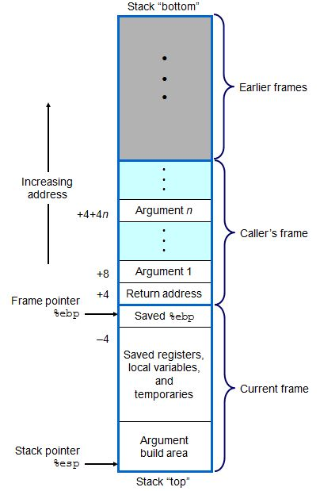

- [3.2 程序编码](#32-程序编码)
- [3.3 数据格式](#33-数据格式)
- [3.4 访问信息](#34-访问信息)
  - [3.4.1 操作数指示符](#341-操作数指示符)
  - [3.4.2 数据传输指令](#342-数据传输指令)
- [3.5 算术和逻辑操作](#35-算术和逻辑操作)
  - [3.5.1 加载有效地址](#351-加载有效地址)
  - [3.5.2 一元操作符和二元操作符](#352-一元操作符和二元操作符)
  - [3.5.3 移位操作](#353-移位操作)
  - [3.5.5 特殊的算术操作](#355-特殊的算术操作)
- [3.6 控制](#36-控制)
  - [3.6.1 条件码（寄存器）](#361-条件码寄存器)
  - [3.6.2 访问条件码](#362-访问条件码)
  - [3.6.3 跳转指令及编码](#363-跳转指令及编码)
  - [3.6.4 翻译条件分支](#364-翻译条件分支)
  - [3.6.5 循环](#365-循环)
      - [1.do-while循环](#1do-while循环)
      - [2.while循环](#2while循环)
      - [3.for循环](#3for循环)
  - [3.6.6 条件传送指令](#366-条件传送指令)
  - [3.6.7 switch语句](#367-switch语句)
- [3.7 过程](#37-过程)
  - [3.7.1 栈帧结构](#371-栈帧结构)
  - [3.7.2 转移控制指令](#372-转移控制指令)
  - [3.7.3 寄存器使用惯例](#373-寄存器使用惯例)
  - [3.7.4 过程示例](#374-过程示例)
  - [3.7.5 递归过程](#375-递归过程)
- [3.8 数组分配和访问](#38-数组分配和访问)
  - [3.8.1 基本原则](#381-基本原则)
  - [3.8.2 指针运算](#382-指针运算)
  - [3.8.3 嵌套的数组](#383-嵌套的数组)
  - [3.8.4 定长数组](#384-定长数组)
  - [3.8.5 变长数组](#385-变长数组)
- [3.9 异质的数据结构](#39-异质的数据结构)
  - [3.9.1 结构](#391-结构)
  - [3.9.2 联合](#392-联合)
  - [3.9.3 数据对齐](#393-数据对齐)
- [3.10 综合：理解指针](#310-综合理解指针)
- [3.12 存储器的越界引用和缓冲器溢出](#312-存储器的越界引用和缓冲器溢出)
- [3.13 x86-64：将IA32扩展到64位](#313-x86-64将ia32扩展到64位)
  - [3.13.2 x86-64简介](#3132-x86-64简介)
- [3.14 浮点程序的机器级表示](#314-浮点程序的机器级表示)


# 3.2 程序编码

计算机系统使用了多种不同形式的抽象，利用更简单的模型来隐藏实现的细节。对于机器级编程来说，其中两种抽象尤为重要。
1. 机器级程序的格式和行为，定义为**指令集体系结构**（Instruction set architecture，ISA）。它定义了处理器状态、指令的格式，以及每条指令对状态的影响。大多数ISA，包括IA32和x86-64，将程序的行为描述成好像每条指令是按顺序执行的。
2. 机器级程序使用的存储器地址是虚拟地址，提供的存储器模型看上去是一个非常大的字节数组。

相比于C代码，IA32机器代码暴露了以下处理器状态：
* **程序计数器**。通常称为“PC”，用`%eip`表示。保存将要执行的下一条指令在存储器中的地址。
* **整数寄存器文件**。包含8个命名位置，都可以存储32位的值。这些寄存器可以存储地址（对应于C语言中的指针）或整数数据。有的寄存器被用来记录某些重要的**程序状态**，而其他的寄存器则用来保存**临时数据**。
* **条件码寄存器**。保存着最近执行的算术或逻辑指令的状态信息。它们用来实现控制或数据流中的条件变化，比如用来实现if和while语句。
* 一组**浮点寄存器**。存放浮点数据。


# 3.3 数据格式

Intel用**字（word）**表示16位数据类型，**双字（double words）**表示32位数据类型，**四字（quad words）**表示64位数据类型。

| C类型         | Intel数据类型 | 汇编代码后缀 | 大小（字节） |
| ------------- | ------------- | ------------ | ------------ |
| char          | 字节          | b            | 1            |
| short         | 字            | w            | 2            |
| int           | 双字          | l            | 4            |
| long int      | 双字          | l            | 4            |
| long long int | -             | -            | -            |
| char *        | 双字          | l            | 4            |
| float         | 单精度        | s            | 4            |
| double        | 双精度        | l            | 8            |
| long double   | 扩展精度      | t            | 10、/2       |

# 3.4 访问信息

一个IA32中央处理器（CPU）包含一组**8个**存储**32位值**的寄存器。这些寄存器用来存储**整数数据**的指针。它们的名字都以`%e`开头，并各有特殊的名字。这是因为，在最初的8086中，寄存器是16位的，每个都有特殊的用途。名字的选择就是反应这些不同的用处。在平坦寻址中，对特殊寄存器的需求已经极大降低。在**大多数情况下**，前6个寄存器都可以看出功能相同的、通用的寄存器，使用上没有区别。我们说“大多数情况下”，是因为有些指令以固定的寄存器作为源寄存器和（或）目的寄存器。另外，在过程处理中（函数调用），对前3个寄存器（`%eax`、`%ecx`、`%edx`）的保持和恢复惯例不同于接下来三个寄存器（`%ebx`、`%esi`、`%edi`）。最后两个寄存器（`%ebp`、`%esp`）保存着指向程序栈中重要位置的指针。只有根据栈管理的标准惯例才能修改这两个寄存器中的值。

**字节操作指令**可以独立地读写**前4个**寄存器的2个低位字节。当一条指令更新这些单字节“寄存器元素”中的一个时，该寄存器剩下的3个字节不会改变。这种特性是为了兼容远古处理器（8008和8080）。
类似地，**字操作指令**可以读写**每个**寄存器的低16位。这个特性一方面是为了兼容16位CPU，另一方面也用于short类型的整数计算。

## 3.4.1 操作数指示符

大多数指令有一个或多个操作数，指示出一个操作中要引用的数据源值，以及放置结果的目标位置。

操作数格式可以分为以下三种：
* **立即数**。也就是常量值。在ATT格式的汇编代码中，立即数的书写方式是`$`后名跟一个用标准C表示法表示的整数，比如`$-577`或`$0x1F`。
* **寄存器**。表示某个寄存器的内容。
    * 对双字操作来说，可以是8个32位寄存器中的一个。
    * 对字操作来说，可以是8个16位寄存器中的一个。
    * 对字节操作来说，可以是8个单字节寄存器元素中的一个。
* **存储器引用**。它会根据计算出来的地址（通常称为有效地址）访问某个存储器位置。
    * 常用寻址模式：`Imm(Eb,Ei,s)`=`M[Imm+R[Eb]+R[Ei]*s]`
      * `Imm`：立即偏移量。
      * `Eb`：基址寄存器。
      * `Ei`：变址寄存器。
      * `Ei`：比例因子。

## 3.4.2 数据传输指令

数据传输指令将源操作数的值复制到目的操作数中。源操作数类型可以是**立即数**、**寄存器**或**存储器引用**。目的操作数可以是**寄存器**或**存储器引用**。但两个操作数**不能同时都是存储器引用**（为什么？）。

数据传输指令有以下4类：
* `MOV S,D`类型：
  * `movb`：传送字节。
  * `movw`：传送字。
  * `movl`：传送双字。
* `MOVS S,D`类型：
  * `movsbw`：将做了符号扩展的字节传送到字。
  * `movsbl`：将做了符号扩展的字节传送到双字。
  * `movswl`：将做了符号扩展的字传送到双字。
* `MOVZ S,D`类型：
  * `movzbw`：将做了零扩展的字节传送到字。
  * `movzbl`：将做了零扩展的字节传送到双字。
  * `movzwl`：将做了零扩展的字传送到双字。
* 栈操作类型：
  * `pushl`：将目标值压栈。
  * `popl`：弹栈并将值放入目标位置。

`MOVS S,D`类型和`MOVZ S,D`类型用于将一个较小的数据复制到一个较大的数据位置。

程序栈存放在存储器中的某个位置。栈向下增长，这样一来，栈顶元素的地址是所有栈中元素地址中最低的。**栈指针**`%esp`保存着栈顶元素的地址。
指令`pushl %ebp`的行为等价于以下两条指令：
```
subl $4,%esp           将栈顶指针减小4
movl %ebp,(%esp)       将%ebp的值放入栈顶元素中
```
指令`popl %eax`的应为等价于：
```
movl (%esp),%eax       将栈顶元素的值放入%eax中
addl $4,%esp           将栈指针增加4
```

# 3.5 算术和逻辑操作

## 3.5.1 加载有效地址

| 指令     | 效果    | 描述                 |
| -------- | ------- | -------------------- |
| leal S,D | D <- &S | 加载有效地址（取址） |

计算寻址模式S，将得到的结果放入D。**目的操作数必须是一个寄存器**。
leal指令即可用于取址，也可用于整数计算。

## 3.5.2 一元操作符和二元操作符

一元操作符：
| 指令  | 效果     | 描述     |
| ----- | -------- | -------- |
| inc D | D <- D+1 | 自增1    |
| dec D | D <- D-1 | 自减1    |
| neg D | D <- -D  | 取负     |
| not D | D <- ~D  | 按位取反 |

操作数既可以是一个寄存器，也可以是一个存储器位置。
每种操作符都有带操作数大小后缀的版本。

二元操作符：
| 指令     | 效果          | 描述     |
| -------- | ------------- | -------- |
| add S,D  | D <- D+S      | 加       |
| sub S,D  | D <- D-S      | 减       |
| imul S,D | D <- D*S      | 乘       |
| xor S,D  | D <- D^S      | 按位异或 |
| or S,D   | D <- D&#124;S | 或       |
| and S,D  | D <- D&S      | 按位与   |

第一个操作数类型可以是**立即数**、**寄存器**或**存储器引用**。第二个操作数可以是**寄存器**或**存储器引用**。但两个操作数**不能同时都是存储器引用**（为什么？）。

注意，第二个操作数既是源又是目的。

每种操作符都有带操作数大小后缀的版本。

## 3.5.3 移位操作

| 指令    | 效果      | 描述              |
| ------- | --------- | ----------------- |
| sal k,D | D <- D<<k | 左移              |
| shl k,D | D <- D<<k | 左移（等同于sal） |
| sar k,D | D <- D>>k | 算术右移          |
| shr k,D | D <- D>>k | 逻辑右移          |

移位量k用单个字节编码，因为只允许进行0到31位的移位（只考虑移位量的低5位）。
目标操作数可以是**寄存器**或**存储器引用**。

每种操作符都有带操作数大小后缀的版本。

个人总结：
汇编语言编程与通常高级语言编程一大不同之处是，汇编语言的能够使用的“变量”是固定的，且都是全局的。汇编语言能够使用8个32位变量（寄存器）、8个16位变量（寄存器）、8个8位变量（寄存器），以及一个数组（存储器）。
注意，寄存器名可类比高级语言中的普通变量，而存储器引用可类比高级语言中的数组角标。但实际上高级语言在编译成汇编语言时，并非时这么一一对应的，只是概念上的一种类比。事实上，我们所谓高级语言中的变量，统统都可以编译为存储器引用。除了必须使用寄存器的特殊场景，实际上可以不用通用寄存器。通用寄存器的主要用途在于优化性能，因为它们的速度最快。将常用的变量放入寄存器中，可以提高性能。

## 3.5.5 特殊的算术操作

以下指令支持产生两个32位数字的全64位乘积和整数除法。

| 指令    | 效果                                                           | 描述                               |
| ------- | -------------------------------------------------------------- | ---------------------------------- |
| imull S | R[%edx]:R[%eax] <- S*R[%eax]                                   | 有符号全64位乘法                   |
| mull S  | R[%edx]:R[%eax] <- S*R[%eax]                                   | 无符号全64位乘法                   |
| cltd    | R[%edx]:R[%eax] <- SignExtend(R[%eax])                         | 转化为四字。将%eax符号扩展到%edx。 |
| idivl S | R[%edx]<- R[%edx]:R[%eax] mod S, R[%eax]<- R[%edx]:R[%eax] / S | 有符号除法                         |
| divl S  | R[%edx]<- R[%edx]:R[%eax] mod S, R[%eax]<- R[%edx]:R[%eax] / S | 无符号除法                         |


# 3.6 控制

## 3.6.1 条件码（寄存器）

除了整数寄存器，CPU还维护着一组单个位（bit）的条件码寄存器，它们描述了最近的算术或逻辑操作的属性。可以检测这些寄存器来执行条件分支指令。
最常用的条件码有：
* `CF`：进位标志。最近的操作使最高位产生了进位。可以用来检查无符号操作数的溢出。
* `ZF`：零标志。最近的操作得出的结果为0.
* `SF`：符号标志。最近的操作得到的结果为负数。
* `OF`：溢出标志。最近的操作导致一个补码溢出——正溢出或负溢出。

leal指令不改变条件码寄存器，因为它是用来进行地址计算的。除此之外的各种计算符，都会（在改变整数寄存器的同时）改变条件码寄存器。

有两类指令，它们只设置条件码寄存器而不改变其他任何寄存器：cmp指令和test指令。

| 指令       | 效果    | 描述 |
| ---------- | ------- | ---- |
| cmp S2,S1  | S1-S2   | 比较 |
| test S2,S1 | S1 & S2 | 测试 |

cmp常用于比较两个数的大小关系。
test常用于检查一个数是整数、负数、还是0。

## 3.6.2 访问条件码

条件码通常不会直接读取，常用的使用方法有三种：
1. 根据条件码的某个组合，将一个字节设置为0或者1；
2. 条件跳转到程序的某个其他的部分；
3. 有条件地传送数据。

对于第1种情况，以下指令根据条件码的某个组合，将一个字节设置为0或者1。我们将这一类指令称为`SET指令`。


| 指令    | 同义名 | 效果 | 设置条件                                                              |
| ------- | ------ | ---- | --------------------------------------------------------------------- |
| sete D  | setz   | -    | 相等/零。上一条操作产生的结果是0。若上一条是CMP指令，则代表两数相等。 |
| setne D | setnz  | -    | 不等/非零                                                             |
| sets D  | -      | -    | 负数                                                                  |
| setns D | -      | -    | 非负数                                                                |
| setg D  | setnle | -    | 大于（有符号>）                                                       |
| setge D | setnl  | -    | 大于等于（有符号>=）                                                  |
| setl D  | setnge | -    | 小于（有符号<）                                                       |
| setle D | setng  | -    | 小于等于（有符号<=）                                                  |
| seta D  | setnbe | -    | 超过（有符号>）                                                       |
| setae D | setnbe | -    | 超过或相等（无符号>=）                                                |
| setb D  | setnae | -    | 低于（无符号<）                                                       |
| setbe D | setna  | -    | 低于或相等（无符号<=）                                                |

SET指令的目的操作数是8个单字节寄存器元素之一，或是存储一个字节的存储器位置。

## 3.6.3 跳转指令及编码

| 指令        | 同义名 | 跳转条件 | 描述     |
| ----------- | ------ | -------- | -------- |
| jmp lable   | -      | -        | 直接跳转 |
| jmp *操作数 | -      | -        | 间接跳转 |
| je Label    | -      | -        | -        |
| jne Label   | -      | -        | -        |
| ……          |
| ……          |


`jmp`指令是无条件跳转，它可以是直接跳转，也可以是间接跳转。
* 直接跳转：给出一个标号作为跳转目标，如`jmp .L1`。
* 间接跳转：`*`后面跟一个操作数指示符，如`jmp *%eax`或`jmp *(%eax)`。

其他跳转指令是条件跳转，即根据一定条件决定是否跳转。条件跳转只能是直接跳转。

当汇编代码被编译为机器代码后，直接跳转的符号标号有两种编码方式：
* 编码为目标指令位置与原本的下一条指令（PC）位置之间的相对距离。
* 编码为目标指令位置的绝对地址。

## 3.6.4 翻译条件分支

C语言中的if-else语句通用模板：

```c
if(test-expr)
    then-statement
else
    else-statement
```

对应的汇编实现形式：

```
    t=test-expr;
    if(!t)
        got false;
    then-statement
    goto done;
false:
    else-statement
done:
```

## 3.6.5 循环

#### 1.do-while循环
do-while循环的通用形式：

```c
do
    body-statement
while(test-expr)
```

对应的汇编形式：

```
loop:
    body-statement
    t=test-expr;
    if(t)
        goto loop;
```

#### 2.while循环

while循环通用形式：

```c
while(text-expr)
    body-statement
```

对应的汇编形式：

```
    t=test-expr;
    if(!t)
        goto done;
loop:
    body-statement
    t=text-expr;
    if(t)
        goto loop;
done:
```

要点：循环体不一定会执行，所以需要先执行一次循环条件的判断。

#### 3.for循环

for循环通用形式：

```c
for(init-expr;test-expr;update-expr)
    body-statement
```
等价于：
```c
init-expr;
while(test-expr){
    body-statement
    update-expr;
}
```

对应汇编形式：

```
init-expr;
if(!test-expr)
    goto done;
loop:
    body-statement
    update-expr;
    t=test-expr;
    if(t)
        goto loop;
done:
```

## 3.6.6 条件传送指令

将条件结构的两个分支都计算，最后根据条件来选择某一个结果赋值。

该语句利用了现代处理器的流水线特性，在两个分支计算都较简单的情况下，能够减少分支预测错误带来的损失，从而提高性能。

## 3.6.7 switch语句

使用跳转表实现多重分支。与多个if-else相比，使用跳转表的优点是执行开关语句的事件与开关情况数量无关（只计算一次）。

*********************************************************************************************************

# 3.7 过程

一个过程调用包括将**数据（以过程参数和返回值的形式）**和**控制**从代码的一部分传递到另一部分。另外，它还必须在进入时为过程的局部变量分配空间，并在退出时释放这些空间。大多数机器，包括IA32，只提供转移控制到过程和从过程中转移出控制这种简单的指令。数据传递、局部变量分配和释放通过程序栈来实现。

## 3.7.1 栈帧结构

IA32程序用程序栈来支持过程调用。机器用栈来**传递过程参数、存储返回信息（Return Address）、保存寄存器用于以后恢复，以及本地存储（本地变量）**。为单个过程分配的那部分栈称为栈帧（stack frame）。下图描绘了栈帧的通用结构（每一个横格代表4个字节）。当前过程对应的栈帧以两个指针界定，**寄存器%ebp为帧指针**，代表当前帧头。**寄存器%esp为栈指针**，代表当前帧尾。当前过程执行期间，帧指针`%ebp`保持不变，而栈指针`%esp`可以移动。因此大多数信息的访问都是相对于帧指针的。



假设过程P（调用者）调用过程Q（被调用者），则P想传给Q的参量将放在P的栈帧中。如上图中的Argument 1。另外，当P调用Q时，P中的返回地址被压入栈中，如上图中Return address。到此为止P的栈帧就结束了。返回地址是当程序从Q返回时应该继续执行的下一条指令的地址。Q的栈帧从保存的P的帧指针的值开始（如上图中的Saved %ebp），后面是保存的其他寄存器的值。

过程Q也用栈帧来保存其他不能放在寄存器中的局部变量。这样做的原因如下：
* 没有足够多的寄存器存放所有的局部变量。
* 有些局部变量是数组或结构，因此必须通过数组或结构引用来访问。
* 要对一个局部变量使用地址操作符`&`，我们必须能够为它生成一个地址。

Q要访问P提供的参数，则需要通过相对于%ebp的偏移来获取。%ebp处存储着4个字节的P的帧指针，再前面是4个字节的返回地址，因此第一个参数是从%ebp+8位置处开始的。访问第n个参数的地址为 8+(n-1)*4=4+4n。

在过程执行过程中，可以通过pushl指令将数据压栈（存储数据，栈指针减小），也可以通过popl指令将数据弹栈（去除数据，栈指针增加）。

注意：当前栈帧的字节数=(帧指针+4)-栈指针。因为帧指针指向的是一个指针类型数据的起始字节位置。

## 3.7.2 转移控制指令

| 指令          | 描述                                               |
| ------------- | -------------------------------------------------- |
| call label    | 过程调用                                           |
| call *Operand | 过程调用                                           |
| leave         | 为返回准备栈（释放当前帧空间，复原上个过程帧空间） |
| ret           | 从过程调用中返回                                   |

call指令有一个目标，用于指明被调用过程其起始指令的地址。同跳转指令一样，可以直接调用，也可以相对调用。

call指令的效果是将返回地址（当前PC值，%eip）压栈（%esp减小），并将PC置为目标过程起始指令地址。注意，此时改变的只是栈指针和PC，帧指针没有改变。即当前栈帧还是调用者的栈帧。被调用者的栈帧是自己建立的。

ret指令的效果是从栈中弹出返回地址（%esp增大），并将其赋值给PC（%eip）。注意，ret需要配置leave使用。

leave指令可以使栈做好返回准备，即释放当前帧空间，复原上个过程帧空间。它等价于下面的代码序列：

```
movl %ebp,%esp
popl %ebp
```

## 3.7.3 寄存器使用惯例

寄存器组时唯一能被所有过程共享的资源。虽然在给定的时刻只有一个过程是活动的，但是我们必须保证当一个过程（调用者）调用另一个过程时（被调用者），被调用者不会覆盖某个调用者稍后会使用的寄存器的值。为此，IA32采用了一组统一的寄存器使用惯例，所有的过程都必须遵守，包括程序库中的过程。

* 寄存器`%eax`、`%edx`、`%exc`是调用者负责保存的寄存器。当过程P调用过程Q时，Q可以随意覆盖这些寄存器，不用担心会破坏P的数据。
* 寄存器`%ebx`、`%esi`、`%edi`是被调用者负责保存的寄存器。即被调用者需要保证在返回之前，这些寄存器的值与刚过程开始时一样。因此，在Q覆盖这些寄存器的值之前，需要把它们保存到栈中，并在返回前恢复它们。

* 寄存器`%ebp`、`%esp`也需要被调用者负责保存。不过可以借助leave指令恢复。

## 3.7.4 过程示例

任何过程包含三部分内容：
1. “建立”部分，初始化栈帧。
2. “主体”部分，执行过程的实际计算。
3. “结束”部分，恢复栈的状态，并返回。

## 3.7.5 递归过程

栈规则提供了一种机制，每次函数调用都有它自己私有的状态信息存储，多个未完成的调用之间不会互相影响。此外，栈的分配和释放规则很自然地与函数的调用-返回顺序匹配。

递归调用和普通函数调用没有什么不同。

*************************************************************************************************************

# 3.8 数组分配和访问

## 3.8.1 基本原则

对于数据类型T和整型常数N，声明如下：

```c
T A[N];
```

它有两个效果：
1. 在存储器中分配一个L*N字节的`连续区域`；这里L是数据类型T的大小（单位为字节），用xA来表示起始位置。
2. 它引入了标识符A;可以用A作为指向数组开头的指针，这个指针的值就是xA。可以用从0到N-1之间的整数索引来访问数组。数组元素i会被存放在地址为xA+L*i的地方。

## 3.8.2 指针运算

C语言允许对指针进行运算，而计算出的值会根据该指针引用的数据类型的大小进行伸缩。也就是说，如果p是一个指向类型为T的数据的指针，p的值为xp，那么表达式p+i的值为xp+L*i，这里L是数据类型T的大小。

## 3.8.3 嵌套的数组

嵌套数组的分配和引用方式与一位数组一样。嵌套数组也是使用一片连续的存储空间，数组元素在存储器中按照“行优先”的顺序排列。

PS：C语言中数组的声明含义与其他语言不同：

```c
int A[5][3]; // 这代表声明一个5行3列的二维数组。即每行3个元素，一共5行。
```

## 3.8.4 定长数组

## 3.8.5 变长数组

*************************************************************************************************************

# 3.9 异质的数据结构

## 3.9.1 结构

`结构`：C语言的`struct`声明创建一个数据类型，将可能是不同类型的对象聚合到一个对象中。结构的各个组成部分用名字来引用。

`结构的实现`：类似于数组的实现，结构的所有组成部分存放在存储器中一段连续的区域内，而指向结构的指针就是结构第一个字节的地址。编译器维护关于每个结构类型的信息，指示每个字段的字节偏移。它以这些偏移作为存储器引用指令中的位移，从而产生对结构元素的引用。

## 3.9.2 联合

`联合`:联合提供了一种方式，能够规避C语言的类型系统，允许以多种类型来引用一个对象。联合声明的语法和结构的语法一样，只不过语言相差比较大。联合是用不同的字段来引用相同的存储块。

## 3.9.3 数据对齐

许多计算机系统对级别数据类型合法地址做出了一些限制，要求某种类型对象的地址必须是某个值K（通常是2、4或8）的倍数。这种对齐限制简化了形成处理器和存储器系统之间接口的硬件设计。例如，假设一个处理器总是从存储器中取出8个字节（64位），则地址必须为8的倍数。如果我们能保证所有的double类型数据的地址对齐成8的倍数，那么就可以用一个存储器操作来读写值了。否则，我们可能需要执行两次存储器访问，因为对象可能被分放在两个8字节存储器块中。

# 3.10 综合：理解指针

指针是C语言的一个重要特征。它们以一种统一方式，对不同数据结构中的元素产生引用。

* 每个指针都对应一个类型。这个类型表明指针指向哪一类对象。指针类型不是机器代码中的一部分，而是C语言提供的一种抽象，帮助程序员避免寻址错误。
* 每个指针都有一个值。这个值是某个指定类型对象的地址。特殊的NULL(0)值表示该指针没有指向任何地方。
* 指针用`&`运算符创建。这个运算符可以应用到任何左值类的C表达式上。
* 运算符`*`用于指针的间接引用。其结果是一个值，它的类型与该指针的类型相关。
* 数组与指针紧密联系。
* 将指针从一种类型强制转换成另一种类型，只改变它的类型，而不改变它的值。强制类型转换的一个效果是改变指针运算的伸缩。
* 指针也可以指向函数。函数指针的值是该函数机器代码中第一条指令的地址。

# 3.12 存储器的越界引用和缓冲器溢出

C对于数组引用不进行任何边界检查，而且局部变量和状态信息（例如保存的寄存器值和返回地址），都存放在栈中。这两种情况结合到一起就可能导致严重的程序错误，对越界的数组元素的写操作会破坏存储在栈中的状态信息。

缓冲器溢出攻击的核心：通过溢出修改函数返回地址，从而强制执行注入代码。

# 3.13 x86-64：将IA32扩展到64位

## 3.13.2 x86-64简介

x86-64机器代码与IA32机器代码有极大不同：
* 指针和长整数是64位长。整数算术运算支持8、16、32和64位数据类型。
* 通用目的寄存器从8个扩展到16个。
* 许多程序状态都保存在寄存器中，而不是栈上。整型和指针类型的过程参数（最多6个）通过寄存器传递。有些过程根本不需要访问栈。（现在帧指针都不存在了！）
* 如果可能，条件操作用条件传送指令实现。
* 浮点操作用面向寄存器的指令集来实现。

# 3.14 浮点程序的机器级表示

把浮点数的存储模型、指令和传递规则的组合称为机器的浮点体系结构。目前有两种：
* x87
* SSE