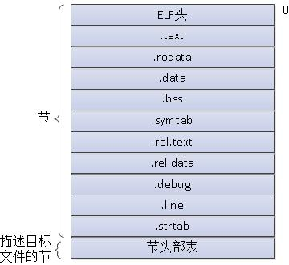
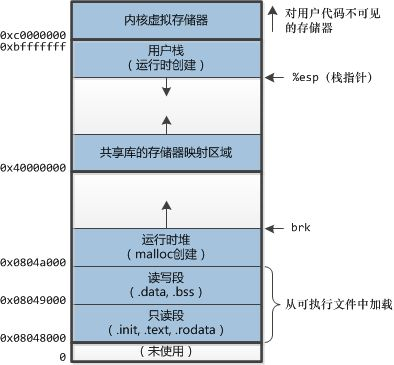

# 7.0 前言

`链接`是将各种代码和数据部分收集起来并组合称为一个单一文件的过程，这个文件可被加载（或被拷贝）到存储器并执行。链接可以执行于`编译时`，也就是在源代码被翻译成机器代码时；也可以执行于`加载时`，也就是程序被加载器加载到存储器并执行时；甚至执行于`运行时`，由应用程序来执行。在早期的计算机系统中，链接时手动执行的。在现代系统中，链接时由叫做链接器的程序自动执行的。

# 7.1 编译器驱动程序

大多数编译系统提供编译驱动程序，它代表用户在需要时调用语言`预处理器`、`编译器`、`汇编器`和`链接器`。

`源文件` --> 预处理器 --> 编译器 --> 汇编器 --> `可重定位目标文件（.o）` --> 链接器 --> `完全链接的可执行目标文件`

# 7.2 静态链接

`静态链接`：以一组可重定位目标文件和命令行参数作为输入，生成一个完全链接的可以加载和运行的可执行目标文件作为输出。每个可重定位目标文件由各种不同的代码和数据节（section）组成。`指令`在一个节中，`初始化的全局变量`在另一个节中，而`未初始化的全局变量`又在另一个节中。

为了构造可执行文件，链接器必须完成两个任务：
* `符号解析`。符号解析的目的是将每个符号引用刚好和一个符号定义联系起来。
* `重定位`。编译器和汇编器生成从地址0开始的代码和数据节。链接器通过把每个符号定义与一个存储器位置联系起来，然后修改所有对这些符号的引用，使得它们指向这个存储器位置，从而重定位这些节。

# 7.3 目标文件

目标文件有三种形式：
* `可重定位目标文件`。包含二进制代码和数据，其形式可以在编译时与其他可重定向目标文件合并起来，创建一个可执行目标文件。
* `可执行目标文件`。包含二进制代码和数据，其形式可以被直接拷贝到存储器并执行。
* `共享目标文件`。一种特殊类型的可重定位目标文件，可以在加载或者运行时动态地加载到存储器并链接。

各个操作系统之间，目标文件格式都不相同。这也是为什么通常为一个系统编写的程序不能在另一个系统上运行。
* 现代Unix系统（比如Linux等），使用“Unix可执行和可链接格式（Executable and Linkable Format）”，即`ELF`。

# 7.4 可重定位目标文件

典型的`ELF`可重定位目标文件的格式：



**ELF头**包含以下信息：
* 一个16字节的序列。这个序列描述了生成该文件的系统的字的大小和字节顺序。
* 帮助链接器语法分析和解释目标文件的信息。

各个节的作用：
* `.text`：已编译程序的机器代码。
* `.rodata`：只读数据。
* `.data`：已初始化的全局C变量（在本文件中声明并初始化的全局变量）。注意，局部C变量在运行时保存在栈中，既不出现在`.data`节中，也不出现在`.bss`节中。
* `.bss`：未初始化的全局C变量。在目标文件中这个节不占据实际的空间，它仅仅是一个占位符。
* `.systab`：一个符号表，它存放在程序中定义和引用的函数和全局变量的信息。
* `.rel.text`：一个`.text`节中位置的列表，当链接器把这个目标文件和其他文件结合时，需要修改这些位置。一般而言，任何调用外部函数或引用全局变量的指令都需要修改。
* `.rel.data`：被模块引用或定义的任何全局变量的重定位信息。一般而言，任何已初始化的全局变量，如果它的初始值是一个全局变量地址或者外部定义函数的地址，都需要被修改。
* `。debug`：一个调试符号表。
* ......

# 7.5 符号和符号表

每个可重定位目标文件都有一个符号表，它包含程序所定义和引用的（全局）符号信息。

注意：在C语言中，对于定义的全局变量和函数来说，`static`关键字的作用是，让该函数或变量称为本文件私有的，相当于C#中的`private`。标记为“私有的”函数和全局变量，不会出现在符号表中。

# 7.6 符号解析

链接器解析符号引用的方法是将每个引用与它输入的可重定位目标文件的符号表中的一个确定的符号定义联系起来。

## 7.6.2 与静态库链接

将相关的函数编译为独立的目标模块，然后封装成一个单独的静态库文件。它可以用作链接器的输入。当链接器构造一个输出的可执行文件时，它只拷贝静态库里被应用程序引用的目标模块。

优点：
* 标准库函数实现与编译器实现分离。
* 节省开发时的磁盘空间。静态库一般统一放在一个众所周知的目录下，而不需要每个项目单独保存一份。
* 节省运行时的内存空间。可执行文件只包含自己引用的那部分模块，而不是全部标准库。
* 当修改标准库函数时，不需要重新编译整个程序，只需要将程序的可重定位目标文件与新的标准库重新链接一次即可。

在Unix系统中，静态库以一种称为存档（archive）的特殊文件格式存放在磁盘中。存档文件时一组可重定位目标文件的集合，有一个头部用来描述每个成员目标文件的大小和位置。

# 7.7 重定位

一旦链接器完成了符号解析这一步，它就把代码中的每个符号引用和确定的一个符号定义联系起来。在此时，链接器就知道它的输入目标模块中的代码节和数据节的确切大小。现在就可以开始重定位了。在这个步骤中，将合并输入模块，并为每个符号分配运行时地址。

重定位由两步组成：
* 重定位节和符号定义。
* 重定位节中的符号引用。

# 7.8 可执行目标文件

# 7.9 加载可执行目标文件

要运行可执行目标文件p，可以在Unix Shell的命令行中输入它的名字：

```bash
unix> ./p
```

因为p不是一个内置的Shell命令，所以Shell会认为p是一个可执行目标文件，通过调用某个驻留在存储器中称为加载器（loader）的操作系统代码来运行它。同时，任何Unix程序都可以通过调用execve函数来调用加载器。加载器将可执行目标文件中的代码和数据从磁盘拷贝到存储器中，然后通过跳转到程序的第一条指令或入口点来运行该程序。这个将程序拷贝到存储器并运行的过程叫做加载。

（注意，对于可执行目标文件的执行，是由操作系统提供支持的。不同的操作系统支持不同的可执行目标文件格式。无论使用什么语言，只要最后编译得到一个符合操作系统规范的可执行目标文件，就可以通过操作系统进行执行。）

每个Unix程序都有一个运行时存储器映像，如下图所示。



在32位Linux系统中，代码段总是从地址0x8048000处开始的（即有一百多M空间未使用）。
然后是`只读端`，包含程序代码和只读类型数据。
接着是`读写端`，包含全局变量。
接着是`运行时堆`，有malloc创建，可向上生长。
接着是`为共享库保留的段`。
接着是`用户栈`，它从最大的合法用户地址开始，向下增长。
最后最上面是`操作系统内核`（占1G）。

当加载器运行时，它创建上图中的存储器映像。在可执行文件中段头表的指导下，加载器将可执行文件的相关内容拷贝到代码和数据段。接下来，加载器跳转到程序的入口点，也就是符号_start的地址。在_start地址处的启动代码是在目标文件ctr1.o中定义的，对所有的C程序都一样。该文件的伪代码如下：

```c
0x080480c0 <_start>:       // .text中的入口点
    call __libc_init_first // 调用.text中的启动代码
    call _init             // 调用.init节的代码
    call atexit            // 附加一系列在应用程序正常中止时应调用的程序。
    call main              // 执行程序主代码
    call _exit             // 将控制还给操作系统
```

加载器的实际工作流程涉及进程、虚拟存储器和存储器映射的概念。在第8章和第9章结束后才能揭开其神秘面纱。
概述：Unix系统中的**每个程序都运行在一个进程上下文中，有自己的虚拟地址空间**。当Shell运行一个程序时，**父Shell进程生成一个子进程，它是父进程的一个复制品**。**子进程通过execve系统调用启动加载器**。加载器删除子进程现有的虚拟存储器段，并创建一组新的代码、数据、堆和栈段。新的栈和对段被初始化为零。**通过将虚拟地址空间中的页映射到可执行文件的页大小的片（chunk），新的代码和数据段被初始化为可执行文件的内容**。最后，加载器跳转到_start地址，它最终会调用应用程序的main函数。除了一些头部信息，在加载过程中没有任何从磁盘到存储器的数据拷贝。知道CPU引用一个被映射的徐你也才会进行拷贝，此时，操作系统利用它的页面调度机制自动将页面从磁盘传送到存储器。

# 7.10 动态链接库

静态库的缺点：
1. 当静态库更新之后，必须显式地将程序代码和新的静态库重新链接。
2. 常用的标准库函数，在运行时会被复制到每个运行进程的文本端中，浪费内存空间。

共享库（shared library）是一个目标模块，在**运行时**，可以加载到任意的存储器地址，并和一个在存储器中的程序链接起来。这个过程称为动态链接，由一个叫做动态链接器的程序来执行的。
共享库也称为共享目标（shared object），在Unix系统中通常用`.so`后缀来表示。微软操作系统大量使用了共享库，它们称为`DLL`（动态链接库）。

共享库以两种方式来“共享”。
1. 在任何给定的文件系统中，对于一个库只有一个`.so`文件。所有引用该库的可执行目标文件共享这个`.so`文件中的代码和数据，而不是像静态库那样被拷贝和嵌入到引用它们的可执行文件中。
2. 在存储器中，一个共享库的.text节的一个副本可以被不同的征兆运行的进程共享。（运行时代码共享）

# 7.11 从应用程序中加载和链接共享库

除了在应用程序之前前，即应用程序被加载时，动态链接器加载和链接共享库以外，应用程序还可能在它运行时要求动态链接器加载和链接任意共享库，而无需在编译时链接那些库到应用中。

# 7.12 与位置无关的代码（PIC）

