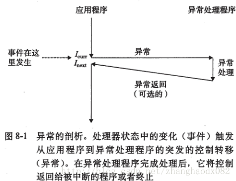
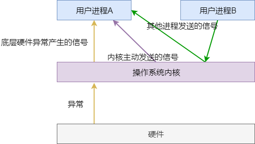

- [8.0 概述](#80-概述)
- [8.1 异常](#81-异常)
  - [8.1.1 异常处理](#811-异常处理)
  - [8.1.2 异常的列表](#812-异常的列表)
    - [1.中断](#1中断)
    - [2.陷阱，和系统调用](#2陷阱和系统调用)
    - [3.故障](#3故障)
    - [4.终止](#4终止)
  - [8.1.3 Linux/IA32系统中的异常](#813-linuxia32系统中的异常)
    - [1.Linux/IA32故障和终止](#1linuxia32故障和终止)
    - [2.Linux/IA32系统调用](#2linuxia32系统调用)
- [8.2 进程](#82-进程)
  - [8.2.1 逻辑控制流](#821-逻辑控制流)
  - [8.2.2 并发流](#822-并发流)
  - [8.2.3 私有地址空间](#823-私有地址空间)
  - [8.2.4 用户模式和内核模式](#824-用户模式和内核模式)
  - [8.2.5 上下文切换](#825-上下文切换)
- [8.3 系统调用错误处理](#83-系统调用错误处理)
- [8.4 进程控制](#84-进程控制)
  - [8.4.1 获取进程ID](#841-获取进程id)
  - [8.4.2 创建和终止进程](#842-创建和终止进程)
  - [8.4.3 回收子进程](#843-回收子进程)
  - [8.4.4 让进程休眠](#844-让进程休眠)
  - [8.4.5 加载并运行程序](#845-加载并运行程序)
  - [8.4.6 利用fork和execve运行程序](#846-利用fork和execve运行程序)
- [8.5 信号](#85-信号)
  - [8.5.1 信号术语](#851-信号术语)
  - [8.5.2 发送信号](#852-发送信号)
  - [8.5.3 接收信号](#853-接收信号)
- [8.6 非本地跳转](#86-非本地跳转)

# 8.0 概述

从给处理器加点开始，直到断电为止，程序计数器假设一个值的序列：

```
a0,a1,a2,a3,...,an-1
```

其中，每个a是某个指令I的地址。每次从ak到ak+1的过渡称为控制转移。这样的控制转移序列叫做处理器的控制流。
最简单的一种控制流是一个“平滑的”序列，其中每个Ik和Ik+1在存储器中都是相邻的。典型的，这种平滑流的突变，也就是IK+1与Ik不相邻，是由诸如跳转、调用和返回这样一些熟悉的程序指令造成的。这些指令使得程序能够对由程序变量表示的内部程序状态中的变化做出反应。**此种状态下，程序完全是按照“自己认为正确并将永远正确”的逻辑在运行，与程序之外的任何事物都没有交互，可称之为“自闭”的**。

**但是程序必然要和外界交互。程序的启动、停止、输入、输出，都是和外界交互的过程。完全“自闭”的程序是不存在的**。换句话说，程序必须能够对系统状态的变化做出反应。这些系统状态不是被内部变量捕获的，甚至可能和本程序的执行无关。

做出反应就意味着要“暂停”当前的正常控制流，即控制流会发送突变。我们把这些突变称为异常控制流。异常控制流发生在计算机系统的各个层次。
* 在硬件层
* 在操作系统层
* 在应用层

# 8.1 异常

异常是异常控制流的一种形式，它一部分由硬件实现，一部分由操作系统实现。异常就是控制流的突变，用来响应处理器状态中的某些变化。



如上图所示，处理器正在执行某个指令Icur，突然**处理器状态中发生了一个重要的变化**。状态变化成为事件（event）。事件可能和当前指令的执行直接相关，如虚拟存储器缺页、算术溢出、试图除零等（即**由当前指令执行导致的**）。另一方面，事件也可能和当前指令的执行没有关系（即**不是由当前指令执行导致的**），如一个系统定时器产生信号或者一个I/O请求完成。

在任何情况下，当处理器检测到有事件发生时，它就会通过一张叫做异常表的跳转表，进行一个间接过程调用，到一个专门处理这类事件的操作系统子程序（异常处理程序）。

当异常处理程序将事件处理完成后，根据引起异常的事件类型，可能发送以下三种情况中的一种：
1. 处理程序将控制返回给当前指令Icur，即重新执行当前指令。
2. 处理程序将控制返回给Inext，即让程序接着继续执行。
3. 处理程序终止被中断的程序。

## 8.1.1 异常处理

计算机系统（软件+硬件）中可能的**每种类型的异常都分配了一个唯一的非负整数的异常号**。其中一些号码由处理器的设计者分配，其他号码由操作系统内核的设计者分配（操作系统内核常驻存储器）。前者的示例包括被零除、缺页、存储器访问违例、断点以及算术溢出。后者的示例包括系统调用和来自外部I/O设备的信号。

在系统启动时，操作系统分配和初始化一张称为**异常表**的跳转表。在运行时，处理器检测到发生了一个事件，然后处理器确定相应的异常号，随后通过异常表执行间接过程调用，跳转到相应的处理程序。

异常处理类似于过程调用，但有一些重要的不同：
* 过程调用和异常处理，在跳转到目标程序之前，处理器会将返回地址压入栈中。对于过程调用来说，当调用返回时一定会从返回地址处开始执行。然而，异常处理程序处理完成后，却不一定会从返回地址继续执行。
* 异常处理时，处理器会把一些额外的处理器状态压入栈中。
* 异常处理程序运行在内核模式下，这意味它们对所有系统资源都有完全的访问权限，使用的栈也是内核栈，而非用户栈。

一旦硬件触发了异常，剩下的工作就是由异常处理程序在软件中完成。在处理程序处理完时间之后，它通过执行一条特殊的“从中断返回”指令，可选地返回到被中断的程序。该指令将适当的状态弹回到处理器的控制和数据寄存器中。

## 8.1.2 异常的列表

| 类别              | 原因              | 异步/同步 | 返回行为             |
| ----------------- | ----------------- | --------- | -------------------- |
| 中断（interrupt） | 来自I/O设备的信号 | 异步      | 总是返回到下一条指令 |
| 陷阱（trap）      | 有意的异常        | 同步      | 总是返回下一条指令   |
| 故障（fault）     | 潜在可恢复的错误  | 同步      | 可能返回当前指令     |
| 终止（abort）     | 不可恢复的错误    | 同步      | 不会返回             |

### 1.中断

中断是异步发生的，是来自处理器外部的I/O设备的信号的结果。**它是硬件中断，不是由任何一条专门的程序指令造成的**。

I/O设备，例如网络适配器、磁盘控制器和定时器芯片，通过处理器芯片上的一个引脚发送信号，并将异常号放到系统总线上，以触发中断，这个异常号标识了引起中断的设备。

（其实更准确的翻译，应该是“打断”，或者“打扰一下”。是指CPU正在正常干活时，某个I/O设备突然闯进来，说“打扰一下，有点事情麻烦您~~~”，然后CPU放下手中的活，处理这个I/O设备的事情，处理完后接着干手上的活。）

### 2.陷阱，和系统调用

陷阱是**程序有意制造的异常**，是一条指令执行的结果。陷阱最重要的用途是在用户程序和内核之间提供一个像过程一样的接口，叫做系统调用。

操作系统是系统资源的管理者（系统资源包括CPU、内存、磁盘、各种外设）。某个程序想要访问某个系统资源，必须向操作系统内核申请，然后由操作系统分配。比如读一个文件、创建一个新进程、加载一个新的程序或终止当前进程。操作系统将这些需求作为内核服务提供给程序。处理器提供了一条特殊的指令`syscall n`用于内核服务申请。当用户程序想要请求服务n时，便可执行该指令。执行该指令会导致一个到异常处理程序的陷阱，这个处理程序对参数解码，并调用适当的内核程序。这个过程称为**系统调用**。

系统调用和普通函数调用看起来很相似，但其实现非常不同。普通的函数运行在**用户模式**中，用户模式限制了函数可以执行的指令的类型，而且他们只能访问与调用函数相同的栈。系统调用运行在**内核模式**中，内核模式允许系统调用执行任何指令，并访问定义在内核中的栈。

（陷阱的意思是，用户程序在地上挖了个坑，让CPU掉如内核模式中，执行系统调用，然后返回。系统调用的指令不属于本程序的指令流，系统调用的过程对本程序是黑箱，因此是异常控制流。）

### 3.故障

故障由错误情况引起，它可能能够被故障处理程序修正。当故障发生时，处理器将控制转移给故障处理程序。如果处理程序能够修正这个错误，它就将控制返回到引起故障的指令，从而重新执行它。否则，故障程序返回到内核中的abort例程，最终终止引起故障的程序。

一个经典的故障示例是缺页异常。

### 4.终止

终止是不可恢复的指明错误造成的结果，通常是一些硬件错误。终止处理程序从不将控制返回给应用程序，而是返回给abort例程，该例程会终止这个应用程序。

## 8.1.3 Linux/IA32系统中的异常

IA32支持多达256种不同的异常类型。其中0-31号是由Intel架构师定义的，因此对任何IA32系统都一样。32-255号是操作系统自定义的中断和陷阱。

| 异常号      | 描述               | 异常类型   |
| ----------- | ------------------ | ---------- |
| 0           | 除法错误           | 故障       |
| 13          | 一般保护故障       | 故障       |
| 14          | 缺页               | 故障       |
| 18          | 机器检查           | 终止       |
| 32-127      | 操作系统定义的异常 | 中断或陷阱 |
| 128（0x80） | 系统调用           | 陷阱       |
| 129-255     | 操作系统定义的异常 | 中断或陷阱 |

注意，**操作系统自定义的要么是中断，要么是陷阱**，没有故障和终止。但是，所有异常类型，无论是否是操作系统自定义的，操作系统都要提供合适的异常处理程序。
**中断是硬件与操作系统交互的方式，陷阱是用户程序和操作系统交互的方式**。

### 1.Linux/IA32故障和终止

* **除法错误**。除以0。
* **一般保护故障**。
* **缺页**。
* **机器检查**。在导致故障的指令执行中检测到致命的硬件错误时发生。

### 2.Linux/IA32系统调用

Linux提供上百种系统调用。每个系统调用都有一个唯一的整数号（即系统服务编号），对应于一个到内核中跳转表的偏移量。

在IA32系统上，异常可以通过`int n`指令来触发。其中n可以是256个异常号中的任意一个。而Linux系统调用对应128号。即`int 128`。

C程序用syscall函数可以直接调用任何系统调用。但是实际中没有必要这么做。大多数系统调用，标准C库提供了一组方便的包装函数，称为系统级函数。这些包装函数以适当的系统调用号陷入内核，然后将系统调用的返回状态传递回调用程序。

在通过`int 128`指令进行系统调用时，所有Linux系统调用的参数都是通过通用寄存器而不是栈传递。按照惯例，寄存器`%eax`存放系统调用号（即系统服务编号），寄存器%ebx、%ecx、%edx、%esi、%edi、%ebp包含最多6个任意参数。栈指针%esp不能使用，因为当进入内核模式时，内核会覆盖它（即使用内核栈，而非用户栈）。

# 8.2 进程

异常时允许操作系统地宫进程的概念所需要的基本构造块。

进程提供给应用程序的关键抽象：
* **一个独立的逻辑控制流**。它提供给程序一个假象，好像自己独占地使用处理器。
* **一个私有的地址空间**。它提供给程序一个假象，好像自己独占地使用存储器系统。

进程的经典定义是**一个执行中的程序的实例**。系统中的每个程序都是运行在某个进程的上下文中的。上下文是由程序正确运行所需的状态组成的。这个状态包括存放在CPU寄存器状态和存储器状态。具体说来，有寄存器、程序计数器、存储器中的程序代码和数据、栈、环境变量、打开的文件描述符等等。

每次用户通过shell输入一个可执行目标文件的名字，并运行一个程序时，外壳就会创建一个新的进程，然后在这个新进程的上下文中运行这个可执行目标文件。应用程序也能够创建新进程，且在这个新进程中运行它们自己的代码或其他应用程序。

## 8.2.1 逻辑控制流

从某个应用程序视角观察程序计数器（PC），会感觉PC值一直都是自己程序或链接的共享库中的指令地址。这个PC值的序列称为**逻辑控制流**。（叫逻辑指令流可能更合适）

之所以叫“逻辑控制流”，是相对于CPU的“实际物理控制流”而言的。一个“实际物理控制流”可能被分为多个“逻辑控制流”，交错执行。同一时间只有一个“逻辑控制流”真正在执行（单核CPU），其他“逻辑控制流”处于挂起暂停的状态。

## 8.2.2 并发流

一个逻辑流的执行在时间上与另一个流重叠，称为并发流，这两个流被称为并发地运行。

多个流并发地执行的一般现象称为**并发**。一个进程和其他进程轮流运行的概念称为**多任务**。一个进程执行它的控制流的一部分的每一时间段叫做时间片。因此，多任务也叫做**时间分片**。

并发地思想与流运行的处理器核数或者计算机数无关。如果两个流并发地运行在不同的处理器核或者计算机上，那么我们称它们为并行流。

## 8.2.3 私有地址空间

进程为每个程序提供它自己的私有地址空间。在一个台有n位地址的机器上，地址空间是2^n个可能地址的集合。

每个进程的地址空间结构是相同的。

## 8.2.4 用户模式和内核模式

处理器通过某个**控制寄存器的模式位**来判断当前处于内核模式还是用户模式。
当设置了模式位时，进程就运行在**内核模式**中，此时可以执行指令集中的**任何指令**，并且可以访问系统中**任何存储器位置**。
当没有设置位模式时，进程就运行在**用户模式**中，此时不允许执行特权指令，比如停止处理器、改变模式位，或者发起一个I/O操作。也不允许直接引用地址空间中内核区内的代码和数据。用户程序必须通过系统调用接口间接地访问内核代码和数据。

运行应用程序代码的进程初始时是在用户模式中的。进程从用户模式变为内核模式的唯一方法是通过诸如中断、故障或者陷入（系统调用）这样的异常。**当异常发生时，控制传递到异常处理程序，处理器将模式从用户模式变为内核模式**。处理程序运行在内核模式中，当它返回到应用程序时，处理器就把模式从内核模式改回用户模式。

Linux提供了`/proc`文件系统，它允许用户模式的进程访问内核数据结构的内容。

## 8.2.5 上下文切换

**操作系统内核**使用一种称为**上下文切换**的较高层次的异常控制流来**实现多任务**。上下文切换机制是建立在8.1节中已经讨论过的较低层次的异常机制之上的。

内核为每个进程维持一个上下文（context）。**上下文就是内核重新启动一个被抢占的进程所需的状态**。它由一些对象的值组成，这些对象包括通用目的寄存器、浮点寄存器、程序计数器、状态寄存器、用户栈、内核栈和各种内核数据结构，比如描绘地址空间的页表、包含有关当前进程信息的进程表，以及包含进程已打开文件信息的文件表（换言之就是寄存器和存储器的状态。但是不知道堆是否包括？）。

在进程执行的某些时刻，**内核可以决定抢占当前进程**，并继续执行之前一个被抢占的进程。这种决定叫做调度，是由内核中的调度器的代码决定的。当内核选择一个新的进程运行时，我们就说内核调度了这个进程。在内核调度了一个新的进程运行后，它就抢占当前进程，并使用一种称为**上下文切换**的机制来将控制转移到新的进程。上下文切换包括以下内容：
1. 保存当前进程的上下文；
2. 恢复某个先前被抢占的进程被保存的上下文；
3. 将控制传递给这个新恢复的进程。

什么情况下会发生上下文切换？
1. 中断可能引发上下文切换。比如，所有操作系统都有某种产生周期性定时器中断的机制，典型的为1毫秒或10毫秒。每次发生定时器中断时，内核就能判定当前进程已经运行了足够长的时间了，并切换到一个新的进程。
2. 陷入（系统调用）可能引发上下文切换。比如，如果系统调用因为等待某个事件而发生阻塞，那么内核可以让当前进程休眠，切换到另一个进程。典型的，如read系统调用，它请求一个磁盘访问，内核可以选择执行上下文切换，运行另一个进程，而不是等待数据从磁盘到达。

硬件告诉缓存存储器不能和诸如中断和上下文切换这样的异常控制流很好地交互。因为告诉缓存不会被保存和恢复。

# 8.3 系统调用错误处理

当Unix系统级函数遇到错误时，它们典型地会返回-1，并设置全局整数变量errno来表示什么出错了。程序员总是应该检查错误。

utils：
错误处理包装函数。
错误报告函数。

# 8.4 进程控制

C语言操作进程的系统调用函数。

## 8.4.1 获取进程ID

每个进程都有一个唯一的正数（非零）进程ID（PID）。

```c
pid_t getpid(void); // 返回当前进程的PID
pid_t getppid(void); // 返回父进程的PID
```

## 8.4.2 创建和终止进程

从程序员的角度，我们可以认为进程总是处于下面三种状态之一：
* 运行。要么正在CPU上执行，要么等待被内核调度。
* 停止。进程被挂起，不会被调度。
* 终止。进程会因为三种原因被终止：
    1. 收到一个信号，该信号的默认行为是终止进程。
    2. 从主程序返回。
    3. 调用exit函数。

```c
void exit(int status); // 以status退出状态来终止进程。
// 也可通过从主程序中返回一个整数值来退出
```

```c
pid_t fork(void); // 创建一个新的运行子进程
```
fork返回值：子进程返回0，父进程返回子进程的PID。如果出错，则返回-1.

新创建的子进程几乎但不完全与父进程相同。
子进程得到父进程的以下拷贝：
* 用户级虚拟地址空间，包括文本、数据、bss段、堆和用户栈。
* 已打开的文件描述符。因此子进程可以读父进程中打开的任何文件。

子进程和父进程最大的不同：**PID不同**。

fork函数的奇妙之处：
* 调用一次，返回两次。父进程和子进程得到不同的返回结果。
* 并发执行。父进程和子进程是并发运行的独立进程。
* 相同的但是独立的地址空间。
* 共享文件。

## 8.4.3 回收子进程

当一个进程由于某种原因终止时，内核并不是立即把它从系统中清除。进程会保持在一种已终止的状态中，直到被它的父进程回收。当父进程回收已终止的子进程时，内核将子进程的退出状态传递给父进程，然后抛弃已终止的进程。从此时开始，该子进程才彻底消失。一个终止了但还未被回收的进程称为僵尸进程。

如果父进程没有回收它的僵尸子进程就终止了，那么内核就会安排init进程来回收它们。init进程的PID为1，并且是在系统初始化时由内核创建的。长时间运行的程序，比如shell或者web服务器，总是应该回收它们的僵尸子进程。因为即使僵尸子进程没有运行了，但依然会消耗存储器资源。

一个进程可以通过调用waitpid函数来等待它的子进程终止或停止。

```c
pid_t waitpid(pid_t pid, int *status, int options);
```

## 8.4.4 让进程休眠

```c
unsigned int sleep(unsigned int secs); //将一个进程挂起一段时间
```

## 8.4.5 加载并运行程序

```c
// 加载并运行可执行目标文件filename，且带参数列表argv和环境变量列表envp
int execve(const char *filename, const char *argv[], const char *envp[]);
```

## 8.4.6 利用fork和execve运行程序

Shell Demo
Shell是一个交互型的应用级程序，它代表用户运行其他程序。

# 8.5 信号

信号是一种更高层的软件形式的异常，它运行进程中断其他进程。

一个信号就是一条消息，它通知进程，系统中发生了一个某种类型的事件。

每种信号类型都对应某种系统事件。底层的**硬件异常**是由内核异常处理程序处理的，正常情况下，对**用户进程而言不可见**。**信号提供了一种机制，来通知用户进程发生了这些（硬件）异常**。



## 8.5.1 信号术语

传送一个信号到目的进程由两个步骤组成：
* 发送信号。**内核**通过更新目标进程上下文中的**某个状态**，来发送一个信号给目的进程。发送信号的的原因可能有两个：
      1. 内核检测到一个系统事件。
      2. 一个进程调用了kill函数。
  一个进程可以发送信号给自己。
* 接收信号。当目标进程被内核强迫以某种方式对信号的发送做出反应时，目标进程就接收了信号。进程可以忽略这个信号，终止，或者通过执行一个称为信号处理程序的用户层函数捕获并处理这个信号。

一个已经发出但是还没有被接收的信号叫做**待处理信号**。在任何时刻，一种类型至多只会有一个待处理信号。后续到达的同类型信号不会排队，而是被丢弃。一个进程可以选择性地**阻塞接收某种信号**。当一种信号被阻塞时，它仍可以被发送，但产生的待处理信号不会被接收，直到进程取消对这种信号的阻塞。

一个待处理信号最多被接收一次。内核为每个进程在pending位向量中维护着待处理信号的集合，而在blocked位向量中维护者被阻塞的信号集合。

## 8.5.2 发送信号

C语言中发送信号的函数

## 8.5.3 接收信号


# 8.6 非本地跳转

C语言提供了一种用户级异常控制流形式，称为非本地跳转。通过`setjmp`和`longjmp`函数提供。

`setjmp`：保存存档。
`longjmp`：读取存档，并返回某个标识值，程序可根据，从存档点开始执行不同的分支。

Java/C#/C++中的try/catch语句原理和这个类似。

