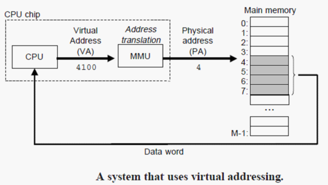

# 9.0 前言

一个系统中的进程是与其他进程**共享CPU和主存资源**的。为了更加有效地管理存储器并且减少出错，现代系统提供了一种对主存的抽象概念，叫做**虚拟存储器**。虚拟存储器是硬件异常、硬件地址翻译、主存、磁盘文件和内核软件的完美交互，他为每个每个进程提供了一个大的、一致的私有的地址空间。

虚拟存储器提供了三个重要能力：
1. 将主存看成是一个存储在磁盘上的地址空间的**高速缓存**。在主存中只保存活动区域，并根据需要在磁盘和主存之间来回传送数据。
2. 为每个进程提供了**一致的地址空间**，从而简化了存储器管理。
3. 保护每个进程的地址空间不被其他进程破坏。

# 9.1 物理和虚拟寻址

计算机系统的主存被组织成一个由M个连续的**字节**的单元组成的**数组**。每个字节都有一个唯一的物理地址。
CPU通过物理地址访问存储器的方式，称为**物理寻址**。

现代处理器普遍使用**虚拟寻址**。使用虚拟寻址时，CPU通过生成一个虚拟地址来访问主存，这个虚拟地址在被送到存储器之前先转换为适当的物理地址。将一个虚拟地址转换为物理地址的任务叫做**地址翻译**。就像异常处理一样，地址翻译需要**CPU硬件和操作系统**之间的紧密配合。CPU芯片上叫做**存储器管理单元（MMU）**的专用硬件利用存放在主存中的**查询表**来动态翻译虚拟地址。该表的内容是由操作系统管理的。

# 9.2 地址空间

虚拟地址空间。大小由系统位数决定。
物理地址空间。

# 9.3 虚拟存储器作为缓存的工具

概念上而言，虚拟存储器被组织为一个由**存放在磁盘上**的N个连续的字节单元组成的**数组**(对于CPU来讲，它是不区分高速缓存、主存和磁盘的。它只知道这个概念上的虚拟存储器。从虚拟存储器到实际的物理存储器，是有MMU负责处理的。)。每个字节都有一个唯一的虚拟地址，这个唯一的虚拟地址是数组的索引。磁盘上的数组被缓存在主存中。磁盘上的数组被分割成大小固定的块，称之为**虚拟页**，这些块作为磁盘和主存之间的传输单元。类似地，物理存储器被分割为**物理页**，也称为页帧。虚拟页和物理页大小相同。

在任意时刻，虚拟页的集合包含三个不相交的子集：
* 未分配的：VM系统还未分配的页（或称之为还未创建的页）。
* 缓存的：当前**已缓存在物理存储器中**的已分配页。
* 未缓存的：当前**没有缓存在物理存储器中**的已分配页。

## 9.3.1 DRAM缓存的组织结构

**SRAM缓存**：CPU和主存之间的L1、L2和L3高速缓存。
**DRAM缓存**：虚拟存储器系统的缓存，它在主存中缓存虚拟页。

DRAM缓存的特点：不命中时处罚极大，访问第一字节开销大（简单说就是访问磁盘速度极慢）。
因此，DRAM组织结构有以下特点：
* 虚拟页很大，典型的是**4KB~2MB**。
* DRAM缓存是全相联的，也就是说，任何虚拟页都可以放置在任何的物理页中。
* 不命中时的替换策略复杂精密。
* DRAM缓存总是使用**写回**，而不是直写。

## 9.3.2 页表

页表是存放在物理存储器中的一个数据结构，页表负责维护**虚拟页到物理页的映射**。

页表就是一个页表条目（PTE）的数组。虚拟地址空间中的**每个页**在页表中一个固定偏移量处都有一个对应的页表条目。简单起见，我们假设每个页表条目由**一个有效位**和**一个n位地址字段组成**。

**有效位**表明了该虚拟页当前是否被缓存在DRAM中。

如果有效位为1，那么地址字段代表DRAM中对应物理页的起始地址。

如果有效位为0，
  * 如果地址字段为空，表示这个虚拟页还未分配。
  * 如果地址字段不为空，则地址字段表示该虚拟页在磁盘上的起始位置。

## 9.3.3 页命中

地址翻译硬件（MMU）将虚拟地址高n位作为索引来定位相应的页表条目。

## 9.3.4 缺页

DRAM缓存不命中称为缺页。

缺页异常将调用内核中的缺页异常处理程序进行处理。该程序将从DRAM中选择牺牲页，将其写回磁盘。然后将缺的页从磁盘拷贝到DRAM中，覆盖牺牲页。同时更新页表。处理完成后，它会重新启动导致缺页的指令（再次执行）。

## 9.3.5 分配页面

当调用malloc时，会在磁盘上创建页，并更新对应页表条目，使它指向磁盘上这个新创建的页。

## 9.3.6 又是局部性救了我们

# 9.4 虚拟存储器作为存储器管理工具

操作系统位每个进程都提供了一个独立的页表，因而也就是一个独立的虚拟地址空间。

虚拟存储器的优点：
* 简化链接。独立的地址空间允许每个进程的存储器映像使用相同的格式，不用关心代码和数据实际存放的物理存储器位置。
* 简化加载。当加载可执行文件时，Linux加载器分配虚拟页的一个连续的片，从地址0x0804800处开始（32位），或者从0x400000处开始（64位），把这些虚拟页标记为无效的（页表条目的有效位置为0），然后将页表条目的地址字段指向目标文件中适当的位置即可。注意，加载器不会真的从磁盘拷贝任何数据到存储器。在每个页被初次访问时，虚拟存储器系统会按照需要自动地调入数据页。将一组连续的虚拟页映射到任意一个文件中的任意位置的表示法称为**存储器映射**。Unix提供了一个称为mmap的系统调用，允许应用程序自己做存储器映射。
* 简化共享。操作系统通过将不同进程中适当的虚拟页面映射到相同的物理页面，从而让多个进程共享某个代码的一个拷贝。典型的，共享操作系统内核代码和C标准库。
* 简化存储器分配。当用户进程要求额外的堆空间时（如调用malloc），操作系统分配k个连续的虚拟存储器页面，并将它们映射到物理存储器中**任意位置**的k个物理页面。由于页表的工作方式，物理页面可以随机分配，没有必要也连续。

# 9.5 虚拟存储器作为存储器保护的工具

通过在页表条目上添加额外的许可位来控制对一个虚拟页面的访问。

# 9.6 地址翻译

MMU如何利用页表来实现虚拟地址空间到物理地址空间的映射？

CPU中的一个控制寄存器——页表基址寄存器——指向当前页表（的地址）。n位的虚拟地址包含两个部分：一个（低）p位的虚拟页面偏移，和一个（高）n-p位的虚拟页号。MMU利用虚拟页号老选择适当的页表条目（页表基址+虚拟页号*条目大小）。

获取到页表条目之后：
* 若有效位为1，则将页表条目中的物理页号和虚拟地址中的虚拟页面偏移串联起来，得到相应的物理地址。
* 若有效位0，则触发一次缺页异常，由操作系统内核中的缺页异常处理程序进行处理。然后重新执行导致缺页异常的指令。

获取到物理地址后，MMU将其传送给告诉缓存/主存，最后高速缓存/主存返回请求的数据给处理器（通过中断interrupt）。

## 9.6.1 结合高速缓存和虚拟存储器

高速缓存作为存储器的缓存，页表条目可以缓存在高速缓存中，就像其他数据一样。

## 9.6.2 利用TLB加速地址翻译

在MMU中添加一个关于页表条目的缓存，称为翻译后备缓冲器（TLB）。

## 9.6.3 多级页表

如果只使用一个单独的页表进行地址翻译，那么需要一个大小恒定的页表永久存放于存储器中，无论应用所引用的虚拟地址空间时多大。
比如，假设有一个32位的虚拟地址空间、4KB的虚拟页面和4KB的PTE，那么页表大小就是4MB。64位系统则更大。

压缩页表的常用方法是使用**层次结构的页表**。

# 9.7 案例研究

## 9.7.2 Linux虚拟存储器系统

Linux为每个进程维持了一个单独的虚拟地址空间。

内核虚拟存储器包含内核中的代码和数据结构。内核虚拟存储器的某些区域被映射到所有进程共享的物理页面。

Linux将虚拟存储器（虚拟地址空间）组织成一些区域（也叫段）的集合。一个区域就是已经存在着的（已分配）虚拟存储器的连续片，这些页是以某种方式关联的。例如，代码段、数据段、堆、共享库段，以及用户栈，都是不同的区域。每个存在的虚拟页面都保存在某个区域中，而不属于某个区域的虚拟页是不存在，并且不能被进程应用。

# 9.8 存储器映射

Linux（以及其他一些形式的Unix）通过将一个虚拟存储器区域与一个磁盘上的对象（object）关联起来，以初始化这个虚拟存储器区域的内容，这个过程称为**存储器映射**。

虚拟存储器区域可以映射到另种类型的对象中的一种：
* Unix文件系统中的普通文件。一个区域可以映射到一个普通磁盘文件的连续部分，例如一个可执行文件。文件区（section）被分成页大小的片，每一片对应一个虚拟页面。因为按需进行页面调度，所以这些虚拟页面没有实际进入物理存储器，直到CPU第一次引用到页面。如果区域比文件区要大，那么就用0来填充这个区域余下的部分。
* 匿名文件。匿名文件是由内核创建的，包含的全是二进制0。CPU第一次引用这样一个区域内的虚拟页面时，内核就在物理存储器中找到一个合适的牺牲页面，如果该页面被修改过，九江这个页面换到磁盘上，然后用二进制0覆盖该页面，并更新页表，将这个页面标记为是驻留在存储器中的。注意在磁盘和存储器之间并没有实际的数据传送。因为这个原因，映射到匿名文件的区域中的页面有时也叫做请求二进制0的页。

无论哪种情况下，一旦一个虚拟页面被初始化了，它就在一个由内核维护的专门的交换文件（swap file）之间换来换去。交换文件也叫作交换空间或者交换区域。在任何时刻，交换空间都限制着当前运行的进程能够分配的虚拟页面的总数。

## 9.8.1 再看共享文件

一个磁盘对象可以被映射到虚拟存储器的一个区域，要么作为共享对象，要么作为私有对象。

如果一个进程将一个共享对象映射到它的虚拟地址空间的一个区域内，那么这个进程对这个区域的任何写操作，对于那么也把这个共享对象映射到它们虚拟存储器的其他进程而言也是可见的。而且，这些变化也会反应到磁盘上的原始对象中。

另一方面，对一个映射到私有对象的区域做的改变，对于其他进程来说是不可见的，并且进程对这个区域所做的任何写操作都不会反应到磁盘上的对象中。这是通过一种叫做“`写时拷贝copy-on-write`”的技术实现的。所谓写时拷贝，就是当多个进程映射同一个私有对象时，首先共享该对象的同一份物理拷贝。知道某个进程打算写这个对象时，才单独拷贝一份该对象，然后更新该进程的页表条目，指向新的拷贝。这样可以节约物理内存。

## 9.8.2 再看fork函数

当fork函数被当前进程调用时，为了给新进程创建虚拟存储器，它原样拷贝当前进程的mm_struct、区域结构和页表。它将两个进程中的每个页面都标记为只读的，并将两个进程中的每个区域结构都标记为私有的写时拷贝。

当fork函数在新进程中返回时，新进程现在的虚拟存储器刚好和调用fork时存在的虚拟存储器相同。当这两个进程中的任一个后来进行写操作时，写时拷贝机制就会创建新页面，从而为每个进程保持了私有地址空间的抽象概念。

## 9.8.3 再看execve函数

execve函数的加载过程包含以下几步：
1. 删除已存在的用户区域结构。
2. 映射私有区域。为加载的新程序的文本、数据、bss和栈区域创建新的区域结构。所有这些新区域都是私有的、写时拷贝的。
3. 映射共享区域。
4. 设计程序计数器。

## 9.8.4 使用mmap函数的用户级存储器映射

# 9.9 动态存储器分配

